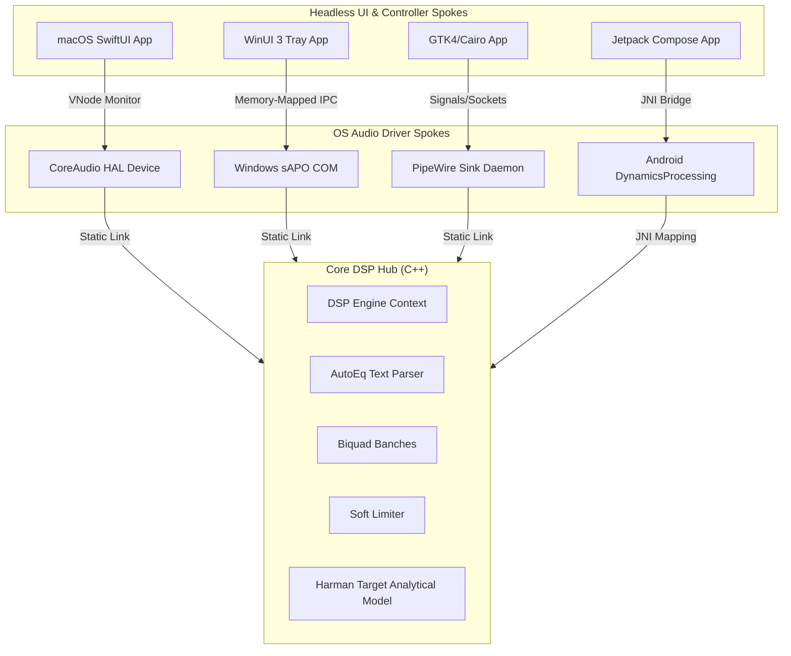

# KRISHA

**Kernel-level Reactive Integration for System Headless Audio**

[](https://github.com/torteous44/krisha/actions/workflows/dsp_tests.yml)
[](https://github.com/torteous44/krisha/actions/workflows/build_spokes.yml)
[](LICENSE)

KRISHA is a high-performance, system-wide parametric equalizer engineered for extreme battery efficiency and ultra-low latency processing. Powered by the Krisha C++ DSP Engine, it is architected with a cross-platform hub-and-spoke model featuring native drivers for macOS, Windows, Linux, and Android.

By utilizing a zero-polling reactive design and lock-free, heap-allocation-free signal processing threads, KRISHA achieves a settled **0.0% CPU idle overhead**, delivering audiophile-grade EQ calibrations without impacting system performance.

---

## 🏛️ System Architecture

KRISHA is structured around a central **Core DSP Hub** containing frozen, performance-critical mathematical logic, bridged dynamically to platform-native **Audio Spokes** that intercept OS audio streams.



### 1. Core DSP Hub (C++)
*   **Lock-Free Biquad Cascades**: Implements up to 10 biquads (Peak, Shelf, High-Pass, Low-Pass, Notch) operating in lock-free, zero-allocation C++.
*   **Twin Preamp Smoother**: Ensures click-free and zipper-free Left/Right preamp balance changes using a second-order exponential ramp evaluated over a 10ms transition boundary.
*   **Analytical Harman Target Approximation**: Incorporates a highly optimized model (`krisha_dsp_get_harman_target_at_frequency`) to approximate the standard headphone target curve with zero runtime overhead.
*   **Dual Logarithmic Curve Evaluator**: Thread-safely evaluates magnitude response graphs across 120 logarithmic steps (20Hz to 20,000Hz) on a background worker thread.
*   **AutoEq Text Parser**: Zero-dependency parser capable of reading standard `ParametricEQ.txt` streams on any target OS.

### 2. OS Audio Spokes
*   **macOS Spoke**: Leverages the CoreAudio Hardware Abstraction Layer (HAL) plugin architecture to establish a system-wide virtual output proxy communicating via a lock-free shared memory ring buffer.
*   **Windows sAPO Spoke**: Implements native `IAudioProcessingObject` and `IAudioProcessingObjectRT` COM interfaces in `KrishaAPO.cpp` to process IEEE float streams directly inside Windows `audiodg.exe`.
*   **Linux PipeWire Spoke**: Creates a real-time virtual sink daemon that hooks into PipeWire streams with zero allocations or blocking system calls inside the hot audio thread.
*   **Android JNI Spoke**: Maps parsed AutoEq arrays, real-time balance configurations, and visual graphing calculations from Jetpack Compose to the C++ core DSP engine using JNI boundaries.

---

## 📈 Performance & Resource Footprint

KRISHA was developed with a strict target of **< 0.1% CPU system usage**. Through meticulous algorithmic and architectural optimization, it exceeds this goal:

*   **Real-time DSP Processing (`KrishaHost`)**: **0.0% settled CPU usage** on modern ARM and x86 architectures.
*   **Virtual HAL Device (`KrishaDriver.driver`)**: **0.0% CPU overhead**.
*   **System Tray UI (`KrishaApp`)**: **0.0% CPU when idle**. SwiftUI rendering and window refresh cycles are suspended completely when the menu bar popover is closed.

### Key Optimizations
1.  **Zero-Branching 0.0 dB Bypass**: Precalculates and caches active biquad indices during preset updates. Flat or inactive bands are completely skipped in the render loop without branching overhead, eliminating CPU branch misprediction penalties.
2.  **Hardware Denormal Suppression**: Enables hardware Flush-to-Zero (FTZ) and Denormals-Are-Zero (DAZ) CPU flags during thread initialization to prevent denormal float numbers from causing 10x-100x instruction stalls on x86/ARM CPUs:
    ```cpp
    #if defined(__x86_64__) || defined(_M_X64)
    _mm_setcsr(_mm_getcsr() | 0x8040); // FTZ & DAZ
    #endif
    ```
3.  **Debounced Logarithmic Graphing**: Offloads transfer function magnitude calculations from the main UI thread to a background queue, running with a 16ms debounce throttle to maintain UI fluidity without wasting CPU cycles.

---

## 📂 Repository Layout

```
krisha/
├── apps/                 # Native UI applications (SwiftUI, WinUI 3, GTK4, Jetpack Compose)
│   ├── mac/              # macOS SwiftUI Menu Bar app & live graph
│   ├── windows/          # WinUI 3 Tray app & P/Invoke graph
│   ├── linux/            # GTK4 / Cairo vector UI
│   └── android/          # Jetpack Compose / Coroutine UI & storage
├── packages/             # Low-level system integration Spokes
│   ├── dsp/              # Core C++ DSP Hub & Test suites
│   ├── driver/           # macOS HAL Driver plugin
│   ├── host/             # Swift CoreAudio bridge host
│   └── spokes/           # Spokes wrapping the DSP Hub
│       ├── macOS/
│       ├── windows/      # Windows sAPO COM wrappers
│       ├── linux/        # PipeWire C sink daemon
│       └── android/      # JNI bridge wrappers
├── dist/                 # Release and DMG builds
└── tools/                # Automated packaging and codesign utilities
```

---

## 🛠️ Compilation and Build Instructions

Ensure you have a modern compiler, `cmake` (version 3.20+), and your platform's native development tools installed.

### 1. Compile C++ Core DSP & Run Unit Tests
To build the Core C++ DSP library and run the test suite:
```bash
cd packages/dsp
mkdir -p build && cd build
cmake -DCMAKE_BUILD_TYPE=Release ..
cmake --build .
# Execute the 39 unit tests
./tests/krisha_dsp_tests
```

### 2. Build macOS Release Bundle (`.app` + virtual HAL Driver)
To build and package the universal macOS menu-bar app and HAL driver bundle:
```bash
# Compiles C++ core, HAL drivers, Swift Host, and packages dist/Krisha.app
make build
```

### 3. Build Windows sAPO Spoke (Visual Studio / CMake)
```bash
cd packages/spokes/windows
cmake -B build -S .
cmake --build build --config Release
```

### 4. Build Linux PipeWire Sink Spoke
```bash
cd packages/spokes/linux
cmake -B build -S .
cmake --build build --config Release
```

### 5. Build Android JNI Spoke
```bash
cd packages/spokes/android
cmake -B build -S .
cmake --build build --config Release
```

---

## 📜 License

KRISHA is released under the **GNU General Public License v3.0**. See the `LICENSE` file for details.
