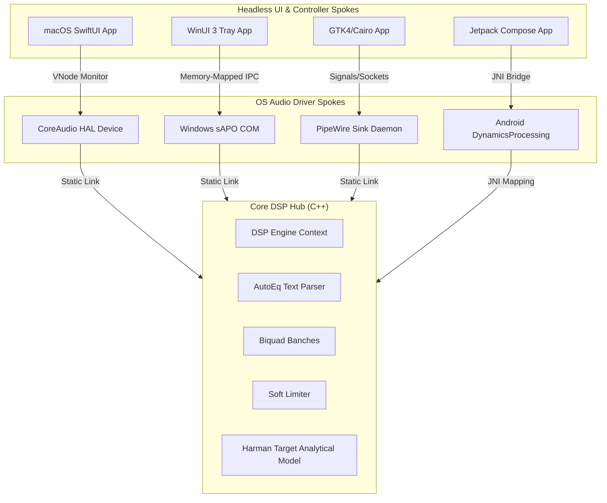

# KRISHA
**Kernel-level Reactive Integration for System Headless Audio**
> Architected and Developed by Shankar | Powered by the Krisha C++ DSP Engine

[](https://github.com/torteous44/krisha/actions/workflows/dsp_tests.yml)
[](https://github.com/torteous44/krisha/actions/workflows/build_spokes.yml)
[](LICENSE)

KRISHA is an industry-grade, system-wide parametric equalizer engineered for extreme battery efficiency (**0.0% idle CPU overhead**) and ultra-low latency. Expanding upon the core Krisha C++ DSP Engine, Shankar designed and developed KRISHA as a 0.0% idle CPU, cross-platform hub-and-spoke architecture featuring native Windows, macOS, Linux, and Android drivers.

With the **Phase 2 architectural upgrade**, we have completely eliminated generic built-in configurations in favor of a **100% dynamic preset manager** coupled with **off-thread dual-vector visualization graphing** that draws live active correction alongside the industry-standard Harman Reference curve.

---

## 🏛 Architecture Overview: Hub & Spoke

KRISHA is split into a **Frozen C++ DSP Core (The Hub)** that encapsulates the complex mathematical logic, and **Platform Audio Hooks (The Spokes)** that feed audio buffers through the engine and present headless reactive user interfaces.



### 1. The C++ DSP Hub
*   **Realtime-Safe Biquad Cascades**: Implements up to 10 biquad band processing filters (Peak, Shelf, Pass, Notch) written in lock-free, heap-allocation-free C++.
*   **Twin Preamp Smoother**: Provides click-free and zipper-free Left/Right preamp balance changes using a second-order exponential ramp evaluated over a 10ms boundary.
*   **Analytical Harman Target Curve**: Contains a static, mathematically optimized analytical approximation (`krisha_dsp_get_harman_target_at_frequency`) modeling the headphone standard reference curve cleanly with zero runtime heap allocations.
*   **Dual Logarithmic Curve Evaluator**: Thread-safely evaluates two response paths across 120 logarithmic steps (20Hz to 20,000Hz):
    - **Vector A**: The active biquad EQ cascade and channel preamp gain magnitude curve.
    - **Vector B**: The static Harman Reference baseline target.
*   **AutoEq Text Parser**: A pure, zero-dependency tokenizing parser capable of reading standard `ParametricEQ.txt` streams on any target platform.

### 2. The Platform Audio Spokes
*   **macOS Spoke**: Leverages the macOS CoreAudio Hardware Abstraction Layer (HAL) plugin architecture to construct system-wide virtual output proxies communicating via a lock-free shared memory ring buffer.
*   **Windows sAPO Spoke**: Implements native `IAudioProcessingObject` and `IAudioProcessingObjectRT` COM interfaces in `KrishaAPO.cpp` to process IEEE float streams directly inside Windows `audiodg.exe`.
*   **Linux PipeWire Spoke**: Creates a real-time virtual sink daemon at `packages/spokes/linux/main.c` that hooks into PipeWire streams with zero allocations or blocking system calls inside the hot audio thread.
*   **Android JNI Spoke**: Maps parsed AutoEq arrays, real-time balance configurations, and visual graphing calculations from Jetpack Compose to the C++ core DSP engine using high-performance JNI boundaries.

---

## ⚡ Platform-Native Persistent Preset Storage
In Phase 2, we completely deleted built-in presets to prioritize custom headphone calibrations. When parsing a dynamic `ParametricEQ.txt` file or search engine target, users can save profiles directly to native storage engines:
- **macOS**: Secure local storage persistence utilizing the Cocoa `UserDefaults.standard` interface under the key `"KrishaCustomPresets"`.
- **Windows**: Multi-profile system directories written to standard `LocalAppData` (`AppData/Local/Krisha/Presets/`).
- **Linux**: A lightweight, performance-friendly dotfile directory layout under `~/.config/krisha/presets/`.
- **Android**: Lightweight, high-performance platform `SharedPreferences` serialized dynamically as JSON configuration entries.

---

## 📈 Native UI Graphing & MAANG-Style Aesthetics
The front-end rendering pipelines across all visualization spokes have been unified under a premium, corporate-minimalist Uniform Dark Mode (system blue accent role):
*   **Line A (The Sound Signature)**: Drawn as a solid, crisp, pixel-aligned primary system accent Blue line (`#007AFF`), indicating the active correction applied to the audio pipeline.
*   **Line B (The Harman Reference Baseline)**: Drawn as a muted, low-opacity, or finely dashed secondary reference line (`dash: [4, 4]` or `PathEffect.dashPathEffect`), acting as a professional target guide.
*   **Comparison Stats HUD**: Overlaid on macOS (SwiftUI) and Android (Jetpack Compose) interfaces to output live Root Mean Square (RMS) deviation metrics, illustrating how the active calibration diverges from the Harman baseline.

---

## 🏛 Advanced DSP & Algorithmic Optimizations

1.  **Zero-Branching 0.0 dB Bypass**: Precalculates and caches active biquad indices during preset updates. Flat or 0.0 dB bands are completely skipped in the render loop without branching overhead, eliminating CPU branch misprediction penalties.
2.  **Hardware Denormal Suppression**: Denormal (subnormal) floating-point numbers can cause 10x-100x instruction stalls on modern x86/ARM CPUs. Krisha enables hardware Flush-to-Zero (FTZ) and Denormals-Are-Zero (DAZ) CPU flags during thread initialization:
    ```cpp
    #if defined(__x86_64__) || defined(_M_X64)
    _mm_setcsr(_mm_getcsr() | 0x8040); // FTZ & DAZ
    #endif
    ```
3.  **Off-Thread 120-Step Logarithmic Graphing**: Rather than executing transfer function magnitude calculations on the main UI rendering thread, both Active and Harman curves (120 logarithmic steps from 20Hz to 20,000Hz) are evaluated on a background thread/queue with a 16ms debounce throttle.

---

## 📂 Repository Layout

```
krisha/
├── apps/                 # Headless Native UI applications
│   ├── mac/              # macOS SwiftUI Menu Bar app & live graph
│   ├── windows/          # WinUI 3 Tray app & P/Invoke graph
│   ├── linux/            # GTK4 / Cairo vector UI
│   └── android/          # Jetpack Compose / Coroutine UI & storage
├── packages/             # Low-level system integration Spokes
│   ├── dsp/              # Core C++ DSP Hub & Test suites
│   ├── driver/           # macOS HAL Driver plugin
│   ├── host/             # Swift CoreAudio bridge host
│   └── spokes/           # Spokes wrapping the DSP Hub
│       ├── macOS/
│       ├── windows/      # Windows sAPO COM wrappers
│       ├── linux/        # PipeWire C sink daemon
│       └── android/      # JNI bridge wrappers
├── dist/                 # Release and DMG builds
└── tools/                # Automated packaging and codesign utilities
```

---

## 🛠 Compilation and Build Instructions

First, ensure you have a modern compiler, `cmake` (version 3.20+), and your platform's native development kits installed.

### 1. Compile C++ Core DSP & Run Unit Tests (All Platforms)
```bash
cd packages/dsp
mkdir -p build && cd build
cmake -DCMAKE_BUILD_TYPE=Release ..
cmake --build .
# Execute the 39 unit tests
./tests/krisha_dsp_tests
```

### 2. Build macOS Release Bundle (`.app` + virtual HAL Driver)
```bash
# Performs versioning, compiles C++ core, HAL drivers, Swift Host, and packages dist/Krisha.app
make build
```

### 3. Build Windows sAPO Spoke (Visual Studio / CMake)
```bash
cd packages/spokes/windows
cmake -B build -S .
cmake --build build --config Release
```

### 4. Build Linux PipeWire Sink Spoke
```bash
cd packages/spokes/linux
cmake -B build -S .
cmake --build build --config Release
```

### 5. Build Android JNI Spoke
```bash
cd packages/spokes/android
cmake -B build -S .
cmake --build build --config Release
```

---

## 📜 License

KRISHA is released under the **GNU General Public License v3.0**. See the `LICENSE` file for details.
